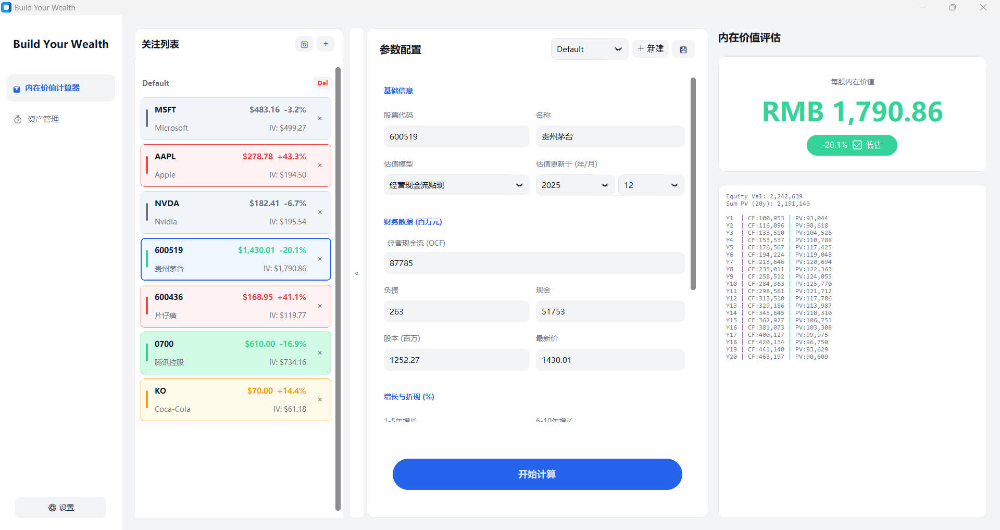
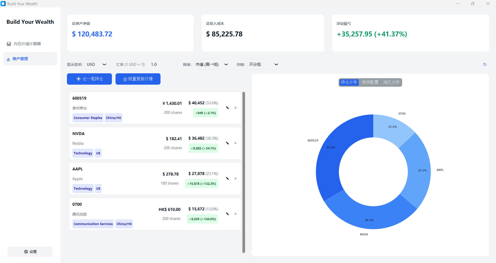

# StockSifu - 股票内在价值计算器和投资组合跟踪器

## 主要功能

### **股票内在价值计算器 (Intrinsic Value Calculator)：**
- 内置现金流折现模型
- 自动保存估值快照到关注列表
### **投资组合跟踪器 (Portfolio Tracker)：** 
- 一目了然地展示持仓代码、名称、市值及盈亏
- 支持美元、人民币、港币等多种资产混合管理
- 自动生成持仓分布、板块配置和地区分布饼图
### **自动行情刷新：** 
- 调用`yfinance`API，一键批量更新所有持仓的最新股价和实时汇率
### **保护隐私：** 
- 所有持仓和财务数据仅存储在本地 JSON 文件中，不上传任何服务器
  
## 安装指南

1. 确保已安装Python 3.8+ 
2. 克隆本仓库
3. 安装依赖：
```bash
pip install -r requirements.txt
```

## 快速开始

1. 运行主程序：
```bash
python main.py
```
2. 首次使用请导入示例数据或创建新的投资组合
3. 在"内在价值计算器"标签页进行股票DCF估值分析
4. 在"资产管理"标签页追踪投资组合

## 文件结构

```StockSifu/
├── main.py                # 程序入口 (Entry point)
├── requirements.txt       # 依赖列表 (Dependencies)
├── config/                
│   └── app_config.json    # 应用配置 (语言设置)
└── data/                  # 数据存储目录 (Data directory)
    ├── my_portfolio.json  # [隐私] 投资组合数据 (由程序自动生成，Git 已忽略)
    ├── dcf_watchlist.json # [隐私] 关注列表 (由程序自动生成，Git 已忽略)
    ├── *_sample.json      # 数据样板文件 (用于示例)
```

## 数据文件

- `data/dcf_watchlist_sample.json` - 估值分析示例数据
- `data/my_portfolio_sample.json` - 投资组合示例数据

## 截图 (Screenshots)

### **内在价值计算器 (Intrinsic Value Calculator)**


### **投资组合跟踪器 (Portfolio Tracker)**


## 免责声明 (Disclaimer)
-本软件仅供个人学习和参考使用，不构成任何投资建议。股市有风险，投资需谨慎。开发者不对因使用本软件产生的任何投资损失负责。
